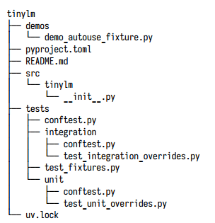
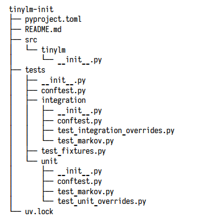

# pytest

## 1. Set up
- Test files should be named `test_*.py` or `*_test.py`.
- Test functions should start with `test_`
- Don't need classes but if use them, name them as `Test*` and skip the `__init__` method.

## 2. How to run?
- To see more details about the test: `uv run pytest -v` 
- Ask pytest what it intends to run: `uv run pytest --collect-only -q`
- Run specific test: `uv run pytest -q -k keyerror`
- Tells pytest to stop immediately after the first failure: `uv run pytest --exitfirst`
- See a few failures before hitting the brakes: `uv run pytest --maxfail=N`
- See only tests that failed during previous run: `uv run pytest --last-failed`
- For test marked with `xfail`: `uv run pytest --runxfail`
- Shorter traceback: `uv run pytest --tb=short`
- Show contents following the short test summary info header: `uv run pytest -ra`

## 3. Parametrization
One of pytest's highest-leverage features. It lets you write a single piece of test logic and run it across multiple examples.

## 4. Skips, Expected Failures and Warnings
- `.` : passed
- `s` : skipped
- `x` : expected failure
- `F` : failed
- `E` : error (an exception escaped the test before it could assert)

## 5. Fixtures
Show fixtures from `conftest.py`: `uv run pytest --fixtures`

```python
@pytest.fixture
def table() -> dict[str, dict[str, int]]:
    """A basic Markov table for 'abc'."""
    return mc.get_table("abc")
```

And you can call it like this

```python
def test_table_fixture(table) -> None:
    assert table == {"a": {"b": 1},
                     "b": {"c": 1}}
```

### Multiple conftest files
We can also have multiple `conftest.py` files in a project. This is how we can structure our project. When a test file looks for a fixture, pytest first checks the local `conftest.py` if it exists, then moves up the parent directories.



### Handling same test file name
If we have separate folders like `/unit` and `/integration` and we want to name the test file with the same name, we need to have empty `__init__.py` for it to work.




### Fixture dependencies
Sometimes a fixture need to call another fixture.

```python
@pytest.fixture
def corpus() -> str:
    return "abc"

@pytest.fixture
def markov(corpus: str) -> mc.Markov:
    return mc.Markov(corpus)
```

### Parametrized Fixtures
The shared `corpus` fixture is parametrized. This means that the fixture is being used by a test, one pytest would run the test multiple times with different values for the fixture

The params arguemnt: A list of values that pytest will use to call the fixture multiple times.

The ids argument: A list of strings that pytest will use to identify each parameter value in test output. This is optional.

```python
@pytest.fixture(
    params=["abc", "xyz", "123"], 
    ids=["letters-abc", "letters-xyz", "digits-123"]
    )
def corpus(request) -> str:
    return request.param
```

```python
def test_parametrized_markov_fixture(corpus: str, markov) -> None:
    assert markov.predict(corpus[0]) == corpus[1]
```

We will see the output

```bash
====================== test session starts ======================
platform darwin -- Python 3.9.6, pytest-8.4.2, pluggy-1.6.0 -- .../code/ch06/
tinylm/.venv/bin/python
cachedir: .pytest_cache
rootdir: .../code/ch06/tinylm
configfile: pyproject.toml
testpaths: tests
collected 26 items / 23 deselected / 3 selected
tests/test_fixtures.py::test_parametrized_markov_fixture[letters-abc] PASSED [ 33%]
tests/test_fixtures.py::test_parametrized_markov_fixture[letters-xyz] PASSED [ 66%]
tests/test_fixtures.py::test_parametrized_markov_fixture[digits-123] PASSED [100%]
======================= 3 passed, 23 deselected in 0.01s =======================
```

### request Attributes
Check note attributes: `uv run pytest -k req -s`

We can use `request.node.name` to tailor our fixture based on the name of the test that's using it. i.e we might want to run slightly different data.

```python
@pytest.fixture
def config(request):
    if "slow" in request.node.name:
        return {"timeout": 10}
    return {"timeout": 1}
```

If tests are marked, our fixture can detect that and configure the database connection accordingly.

```python
@pytest.fixture
def db_connection(request):
    mode = request.node.get_closest_marker("db")
    readonly = mode.args[0] if mode else "readwrite"
    return create_db_connection(readonly=(readonly == "readonly"))
```

```python
@pytest.mark.db("readonly")
def test_readonly_db(db_connection):
    result = db_connection.query("SELECT * FROM users")
    assert result is not None
```

If we need to make our cleanup code dynamic, we can use `addfinalizer`.

```python
@pytest.fixture
def resource(request):
    handle = create_resource()
    request.addfinalizer(lambda: handle.release())
    return handle
```

This is the `yield` method, which also does the same thing

```python
@pytest.fixture
def resource():
    handle = create_resource()
    yield handle
    handle.release()
```

### Using `tmp_path`

Gives each test a fresh, isolated temporary directory that ensures that each test operates in a clean environment.

```python
@pytest.fixture
def sample_text_file(tmp_path, corpus):
    path = tmp_path / "sample.txt"
    path.write_text(corpus)
    return path
```

```python
def test_train_from_path(sample_text_file, corpus) -> None:
    model = mc.train_from_path(sample_text_file)
    assert model.tables[0] == mc.get_table(corpus)
```

### Scope
Fixtures can have different liftimes.

| Scope | Description |
| :--- | :---: |
| `function` (default) | A new value is created for each test function |
| `class` | A new value is created once per test class. All methods in the class share the same fixture instance |
| `module` | A new value is created once per module. All tests in the module share the same fixture instance |
| `session` | A new value is created once per test session. All test across all modules share the same fixture instance. |

- A function-scoped fixture is cached for one test. 
- A module-scoped fixture is cached for the module. 
- A session-scoped fixture is cached for the entire run.

```python
@pytest.fixture(scope="function")
def fresh_table(training_text: str) -> dict:
    return get_table(training_text, size=1)

def test_model_has_correct_size(model):
    assert len(model.tables) == 2

def test_model_predicts_valid_next(model):
    result = model.predict("ab")
    assert result in {"c"}

def test_missing_key_raises(model):
    with pytest.raises(KeyError):
        model.predict("zz")

class TestTrainFromPath:
    def test_train_from_path(self, text_file):
        model = train_from_path(text_file, size=1)
        assert isinstance(model, Markov)
        assert model.predict("x") in {"y"}
        
    def test_train_raises_keyerror(self, text_file):
        model = train_from_path(text_file, size=1)
        with pytest.raises(KeyError):
            model.predict("z") # 'z' is followed by no character in final positio
            
def test_fresh_table_has_expected_keys(fresh_table):
    # This runs get_table(training_text, size=1) per test
    assert "a" in fresh_table
    assert "b" in fresh_table
```

### Teardown with `yield` Fixtures
`yield` fixtures work by turning the fixture into a generator. 
- The code before the `yield` sets up the resource
- the function yields and then the test is executed. 
- After the test finishes, whether it passes or fails, pytest resumes the generator after the `yield` statement.

```python
@pytest.fixture
def scratch_file(tmp_path: Path):
    path = tmp_path / "scratch.txt"
    path.write_text("temporary\n", encoding="utf-8")
    yield path
    path.unlink(missing_ok=True)
```

### Global state fixtures
Need to restore the previous state

```python
@pytest.fixture
def fixed_random_seed():
    state = random.getstate()
    random.seed(0)
    yield
    random.setstate(state)
```

## 6. Running & Debugging
